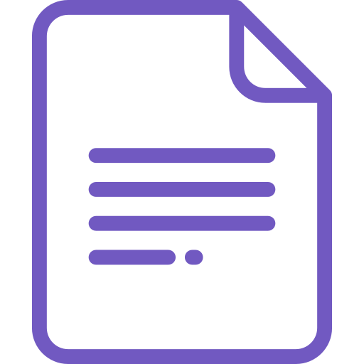

  

<h2 align="center">
  @rocketseat/gatsby-theme-docs
</h2>

  Out of the box Gatsby Theme for creating documentation websites easily and quickly.

  

  

  

  <a href="#rocket-docs">Features</a> •
  <a href="#-docs">Docs</a> •
  <a href="#-contributing">Contributing</a> •
  <a href="#-roadmap">Roadmap</a> •
  <a href="#memo-license">License</a>

## :rocket: Features

- MDX for docs;
- Code and syntax highlighting with PrismJS;
- PWA;
- Sidebar customization with Yaml;
- SEO (schema.org data, Open Graph and Twitter tags).
- Google Analytics support;

## ✍🏻 Docs

Full documentation for `@rocketseat/gatsby-theme-docs` lives [on the website](https://gatsby-theme-rocketseat.github.io).

## ✨ Contributing

Thanks for being interested in contributing! We’re so glad you want to help! Please take a little bit of your time and look at our [contributing guidelines](https://github.com/Rocketseat/gatsby-theme-rocketseat/blob/master/.github/CONTRIBUTING.md) and our
[code of conduct](https://github.com/Rocketseat/gatsby-theme-rocketseat/blob/master/.github/CODE_OF_CONDUCT.md)! All type of contributions are welcome, such as bug fixes, issues or feature requests. Also, don't forget to check the [roadmap](#roadmap).

## 🚗 Roadmap

If you'd like to see our next steps or in which feature our bug fix we are working on, please check our [roadmap project](https://github.com/Rocketseat/gatsby-theme-rocketseat/projects/2).

## :memo: License

Licensed under the [MIT License](./LICENSE).

---

Made with 💜 by Rocketseat :wave: [check our community!](https://discordapp.com/invite/gCRAFhc)
